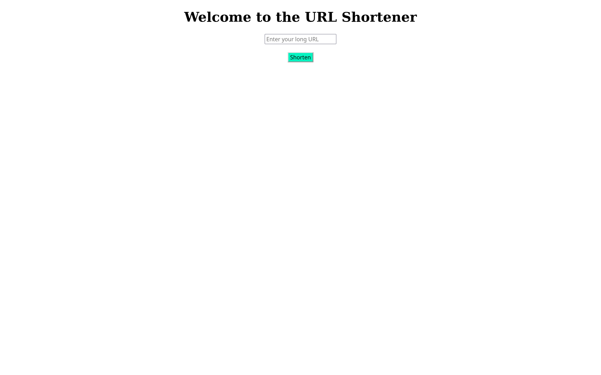

# url_shortener
> This is a URL Shortener Application which is implemented in Flask

## How to use this project
> Follow the steps

> ## Step 1
```shell
git clone https://github.com/Nithish6606/url_shortener.git
```
> ## Step 2
```shell
cd url_shortener
```
> ## Step 3
```shell
pip install -r requirements.txt
```

> ## Step 4
```shell
python main.py
```

# Output

